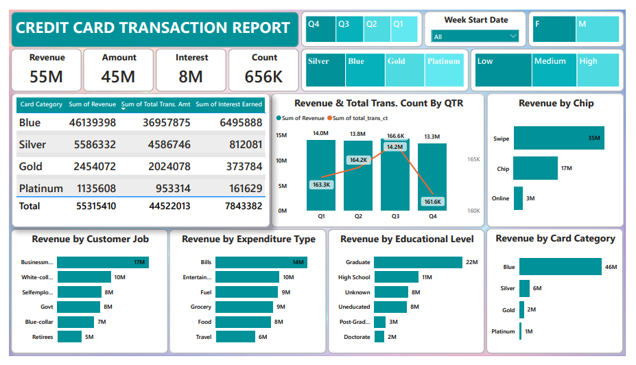

# Credit Card Transaction and Customer Analysis Dashboard

Power BI dashboard analyzing credit card transactions and customer insights.

## Dashboard Preview

### Credit Card Transaction Dashboard

### Credit Card Customer Dashboard

## Tools Used
- SQL
- Power BI
- Excel

## Project Overview
This dashboard provides insights into credit card transactions, customer spending patterns, and revenue trends.

## Project Objective
To analyze credit card transactions and customer behavior using Power BI and generate insights into spending patterns, revenue trends, and customer segmentation.

## Project Workflow
1. Imported datasets into SQL database
2. Connected SQL database with Power BI
3. Performed data cleaning and transformation
4. Created relationships between tables
5. Built interactive dashboards and KPI visualizations

## Key Insights
- Identified top spending categories among customers
- Analyzed revenue trends across different regions
- Visualized customer transaction behavior
- Highlighted customer segmentation patterns
